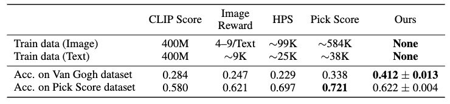

# CAS: A Probability-based Approach for Universal Condition Alignment Score

>This repository contains the official implementation for the paper [CAS: A Probability-based Approach for Universal Condition Alignment Score](https://openreview.net/forum?id=E78OaH2s3f) <br> by [Chunsan Hong](https://sites.google.com/view/chunsanhong)<sup>\*</sup>, ByungHee Cha<sup>\*</sup>, [Tae-Hyun Oh](https://ami.postech.ac.kr/members/tae-hyun-oh).


[Project Page](https://unified-metric.github.io/)

## Updates
* [02/11/2024] We released our code. Anyone can reproduce our experiment on the PickScore dataset. Please note that the reproduction code for the experiment on the Van Gogh dataset and multimodal dataset we built will be released soon.

## About our paper
### What is the purpose of CAS?
Recent conditional diffusion models have shown remarkable advancements and have been widely applied in fascinating real-world applications. However, samples generated by these models often do not strictly comply with user-provided conditions. The goal of CAS is to evaluate this alignment to select well-generated samples.


CAS leverages the conditional probability measurable through the diffusion process. Our technique operates across all conditions and requires no additional models beyond the diffusion model used for generation, effectively enabling self-rejection. Our experiments validate that our metric effectively applies in diverse conditional generations, such as text-to-image, {instruction, image}-to-image, edge-/scribble-to-image, and text-to-audio. 

Examples of generated samples ordered by our universal score for various conditions is shown in the figure below:


From left to right, the sequence shows the conditional diffusion model used, the employed condition, two high-ranked samples, and two low-ranked samples. The last column’s generation is audio, so it is visualized using a Mel Spectrogram. Our metric demonstrates automatic and reliable assessment of perceptual alignment between condition and generated results (i.e., cherry-picking without humans) across text-to-image models (Stable Diffusion V1.5), diffusion models trained on specific domains such as Van Gogh, InstructPix2Pix, ControlNet, and AudioLDM, but not limited to.

## How to run the code
### Dependencies
Run the following to install a subset of the necessary Python packages for our code. Make sure that the installed versions of packages and the specified versions are identical. Since CAS requires exact measurements, minor details can cause significant differences. Specifically, the cumulative product of alphas is a bit different in the DDIM scheduler, which may result in different reproduction outcomes.
```
pip install -r requirements.txt
```

### Experiment Reproduction on the PickScore dataset


We demonstrate the performance of our technique on the PickScore benchmark to evaluate the capability of CAS as an alignment score between text and image. The PickScore dataset contains two pairs of images for each prompt, along with human preference labels. Here, we measure how well CAS aligns with human preferences. For more information on the PickScore dataset, please refer to https://github.com/yuvalkirstain/PickScore.





Run the following to reproduce our experiment on the PickScore dataset. To reproduce the experiment, just use the default command-line arguments. Please note that the result might slightly change due to the JPEG decompression codec of your computer. The PickScore dataset had offered PNG files in the past, yet it now offers JPEG files. We confirmed using 3 different computers with different codecs that the CAS value itself may differ, but the overall result is almost the same. Please inform us if there is a critical degradation in performance. If there is a problem, we will consider ways to share PNG files.
```
python test_cas_pickscore.py --total_step #your_total_step --approx_num #your_approx_num --rec_num #your_rec_num
```

## References
If you find the code useful for your research, please consider citing
```
@inproceedings{
  hong2024CAS,
  title={CAS: A Probability-based Approach for Universal Condition Alignment Score},
  author={Chunsan Hong and ByungHee Cha and Tae-Hyun Oh},
  booktitle={International Conference on Learning Representations},
  year={2024},
  url={https://openreview.net/forum?id=E78OaH2s3f}
}
```