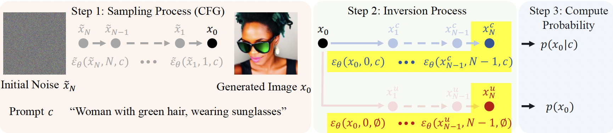
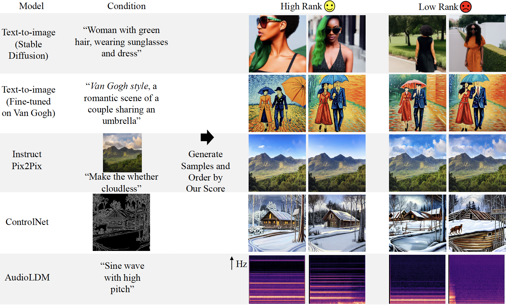

# CAS: Universal Condition Alignment Score

>This repository contains the official implementation for the paper "CAS: Universal Condition Alignment Score"   by Chunsan Hong, Byunghee Cha, Tae-Hyun Oh.

We propose a universal condition alignment score that leverages the conditional probability measurable through the diffusion process. Our technique operates across all conditions and requires no additional models beyond the diffusion model used for generation, effectively enabling self-rejection. Our experiments validate that our metric effectively applies in diverse conditional generations, such as text-to-image, {instruction, image}-to-image, edge-/scribble-to-image, and text-to-audio. The basic idea is captured in the figure below:

Examples of generated samples ordered by our universal score for various conditions is shown in the figure below:

From left to right, the sequence shows the conditional diffusion model used, the employed condition, two high-ranked samples, and two low-ranked samples. The last column’s generation is audio, so it is visualized using a Mel Spectrogram. Our metric demonstrates automatic and reliable assessment of perceptual alignment between condition and generated results (i.e., cherry-picking without humans) across text-to-image models (Stable Diffusion V1.5), diffusion models trained on specific domains such as Van Gogh, InstructPix2Pix, ControlNet, and AudioLDM (Liu et al., 2023), but not limited to.